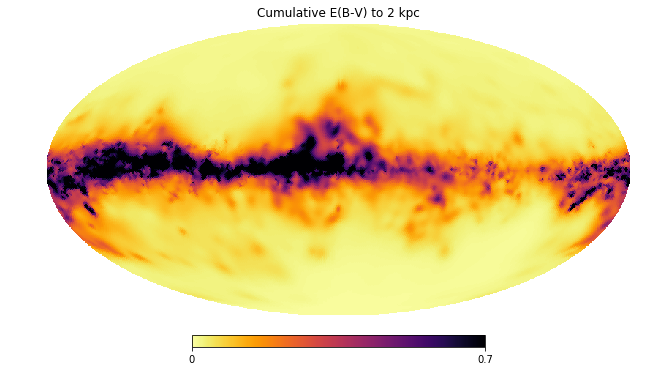

3D dust maps
======

**DESCRIPTION**

This package provides a convenient way of accessing the Lallement et al. (2018) dust maps (https://arxiv.org/abs/1804.06060). It returns the E(B-V) value at Galactic coordinates l, b and distance d (in pc) *with no interpolation in distance*.
It is stored as a series of Healpix maps with Nside=64, so has an angular resolution of ~0.9 deg over the whole sky. It covers heliocentric distances up to 2 kpc, with a distance resolution of 20 pc (downsampled from the original 5 pc resolution for efficiency).

**INSTALL**

- in a folder that is already in the PYTHONPATH, create a new folder called ``dust_maps_3d``.
- copy both the python file (lallement18.py) and the corresponding FITS maps (lallement18_nside64.fits.gz) in the ``dust_maps_3d`` folder.

**PYTHON VERSIONS AND DEPENDENCIES**

This code has been tested on both Python 2.7 and 3.6.
The Numpy, Astropy, and Healpy libraries are required.

**USAGE**

Basic usage::

    >>> from dust_maps_3d import lallement18 as l18
    >>> print(l18.ebv(30,0,300))
    0.111

It also accepts array-like input. For example, with lists::

    >>> print(l18.ebv([10,30,90,180,280],[60,-20,0,45,-45],[100,200,300,400,500])
    [0.01, 0.088, 0.025, 0.021, 0.056]

Or with a Pandas DataFrame containing a high-accuracy subset of the Gaia DR2 data::

    >>> ebv = l18.ebv(gdr2['l'], gdr2['b'], 1/gdr2['parallax'])

Like the stilism.obspm.fr tool it can return the E(B-V) curve as a function of distance (without uncertainties)::

    >>> import matplotlib.pyplot as plt
    >>> plt.plot(range(0,900,20), l18.ebv(10,20,range(0,900,20)))
    >>> plt.show()

Finally, to plot full-sky dust maps at a given distance::

    >>> import numpy as np
    >>> import healpy as hp
    >>> import matplotlib.pyplot as plt
    >>> from dust_maps_3d import lallement18 as l18
    >>> 
    >>> l, b = hp.pix2ang(64, np.arange(49152), lonlat=True)
    >>> distance = 2000.
    >>> d = np.ones(np.shape(l))*distance
    >>> 
    >>> cmap = plt.get_cmap('inferno_r')
    >>> cmap.set_under('w')
    >>> hp.mollview(l18.ebv(l, b, d), min=0, max=0.7, cmap=cmap, title='Cumulative E(B-V) to 2 kpc')

**CREDIT**

This package makes use of the dust maps calculated by `Lallement et al. (2018) <https://arxiv.org/abs/1804.06060>`__ and made available at http://stilism.obspm.fr.
